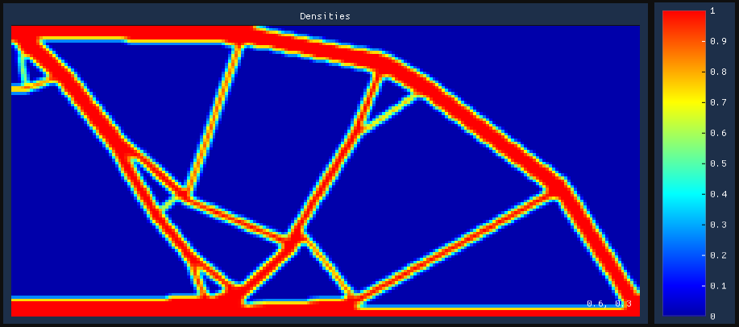
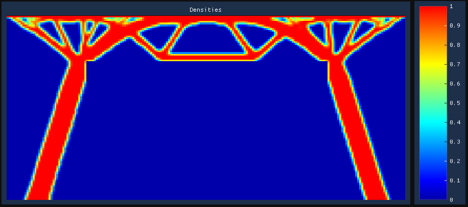

# topology_optimization

This project implements from scratch stress-strain finite element analysis and
topology optimization.

MBB beam:



Support for a distributed load at the top and a clear center:



## Build

All dependencies are handled
by [CPM.cmake](https://github.com/cpm-cmake/CPM.cmake).

```
git clone https://github.com/mschertenleib/topology_optimization.git
cd topology_optimization
cmake -S . -B build -DCMAKE_BUILD_TYPE=Release
cmake --build build --target topology_optimization
```

## Dependencies

- [Eigen](https://gitlab.com/libeigen/eigen)
- [GLFW](https://github.com/glfw/glfw)
- [Dear ImGui](https://github.com/ocornut/imgui)
- [Implot](https://github.com/epezent/implot)

## Notes

- Performance-wise, we are limited by the capabilities of Eigen's sparse
  solvers (solving the FEA problem takes 90% to 97% of the computation
  time). We also seem to get numerical issues with most iterative solvers, so
  there might be something to do on that side. We should probably look into
  interfacing with third-party libraries from Eigen.

- `EIGEN_NO_AUTOMATIC_RESIZING` apparently breaks some operations. For example,
  when a default-constructed dense `dst` is assigned a sparse `src`, the
  fundamental operations executed are:
  ```
  dst._resize_to_match(src);
  dst.setZero();
  resize_if_allowed(dst, src);
  for each coeff in non-zeros of src:
      dst(coeff.index) = coeff.value;
  ```
  If `EIGEN_NO_AUTOMATIC_RESIZING` is defined, `dst._resize_to_match(src)` is a
  no-op **even if `dst` has size 0**, and the call to `setZero()` does nothing
  (because `dst` still has size 0). Then `resize_if_allowed(dst, src)` actually
  resizes `dst` to the size of `src`, and leaves its coefficients uninitialized.
  Therefore only the coefficients corresponding to non-zeros of `src` are
  assigned to, while the others keep their uninitialized value (NaN
  if `EIGEN_INITIALIZE_MATRICES_BY_NAN` is defined).

  If `EIGEN_NO_AUTOMATIC_RESIZING` is not defined, the resizing of `dst` happens
  in `dst._resize_to_match(src)`, **before** the `setZero()`, and everything
  works as expected.

## References

- F. Ferrari and O. Sigmund, "A new generation 99 line Matlab code for
  compliance topology optimization and its extension to 3D", _Structural and
  Multidisciplinary Optimization_, vol. 62, pp. 2211–2228, 2020,
  doi: https://doi.org/10.1007/s00158-020-02629-w.

- Q. Xia and T. Shi, "Topology optimization of compliant mechanism and its
  support through a level set method", _Computer Methods in Applied Mechanics
  and Engineering_, vol. 305, pp. 359-375, 2016,
  doi: https://doi.org/10.1016/j.cma.2016.03.017.

- M. Liu, J. Zhan, B. Zhu and X. Zhang, "Topology optimization of compliant
  mechanism considering actual output displacement using adaptive output spring
  stiffness", _Mechanism and Machine Theory_, vol. 146, p. 103728, 2020,
  doi: https://doi.org/10.1016/j.mechmachtheory.2019.103728.

- X. Huang, Y. Li, S. W. Zhou and Y. M. Xie, "Topology optimization of compliant
  mechanisms with desired structural stiffness", _Engineering Structures_, vol.
  79, pp. 13-21, 2014, doi: https://doi.org/10.1016/j.engstruct.2014.08.008.

- B. Zhu, X. Zhang, H. Zhang, J. Liang, H. Zang, H. Li and R. Wang, "Design of
  compliant mechanisms using continuum topology optimization: A review",
  _Mechanism and Machine Theory_, vol. 143, p. 103622, 2020,
  doi: https://doi.org/10.1016/j.mechmachtheory.2019.103622.

- K. Liu and A. Tovar, "An efficient 3D topology optimization code written in
  Matlab", _Structural and Multidisciplinary Optimization_, vol. 50, pp.
  1175-1196, 2014, doi: https://doi.org/10.1007/s00158-014-1107-x.

- C. S. Andreasen, M. O. Elingaard and N. Aage, "Level set topology and shape
  optimization by density methods using cut elements with length scale control",
  _Structural and Multidisciplinary Optimization_, vol. 62, pp. 685-707, 2020,
  doi: https://doi.org/10.1007/s00158-020-02527-1.

## License

This project is released under [MIT License](LICENSE).
